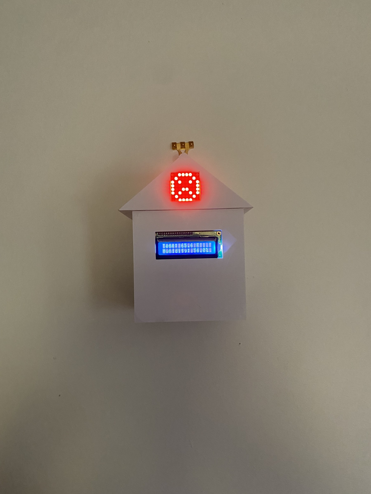
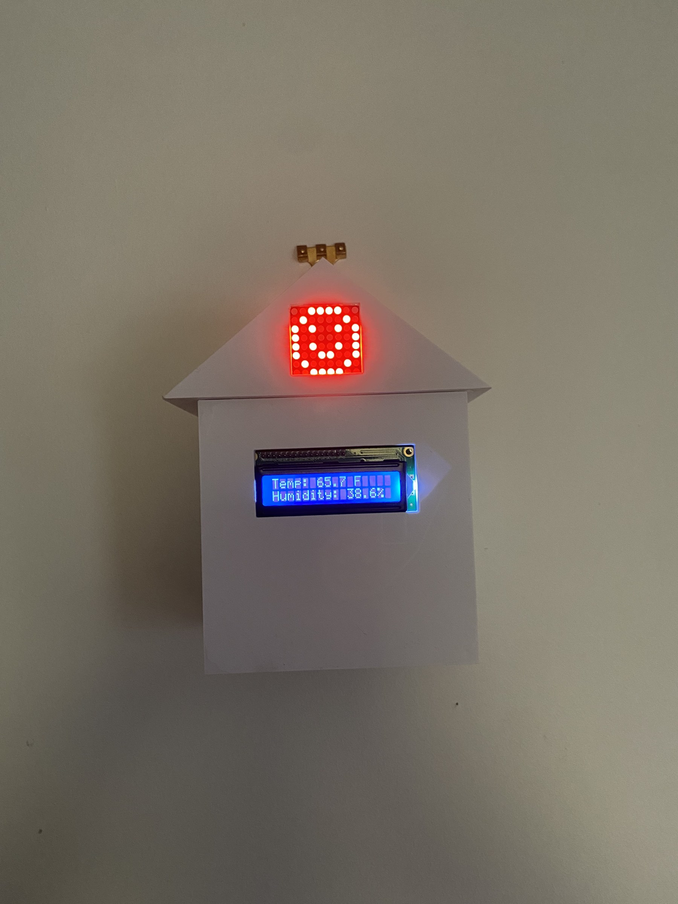
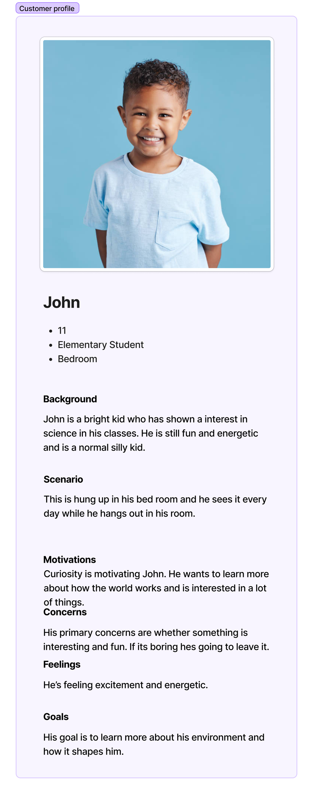
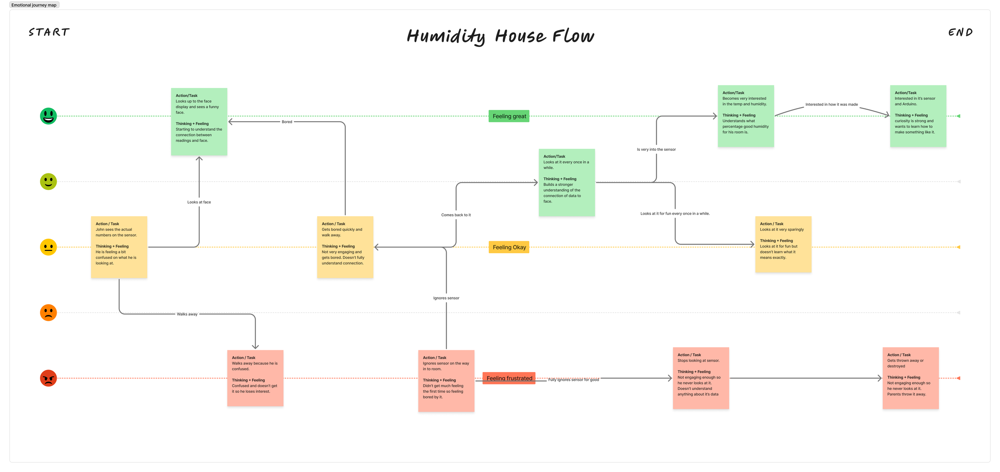
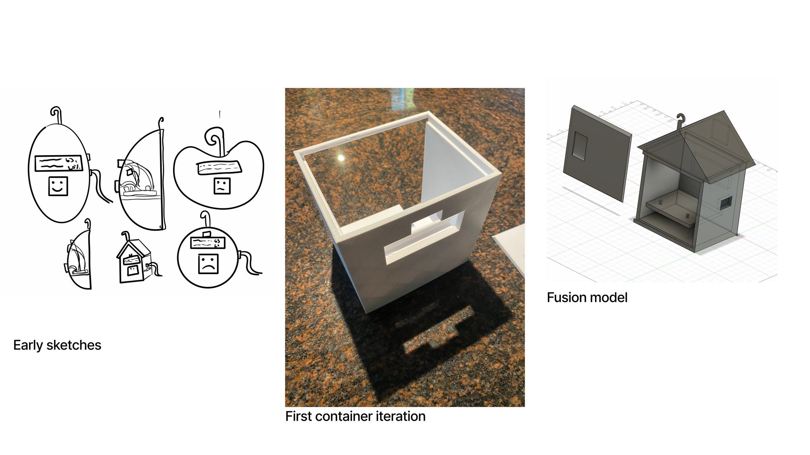
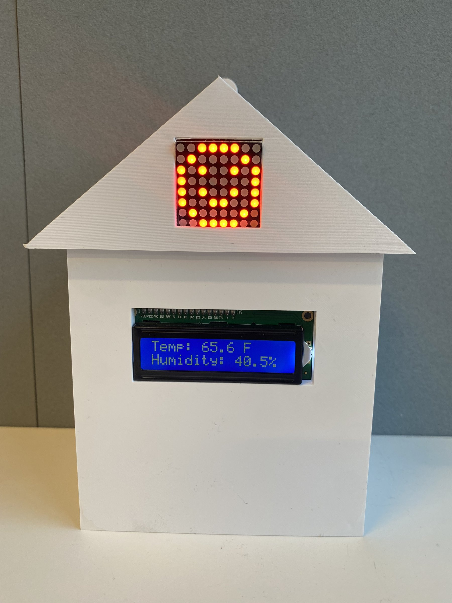
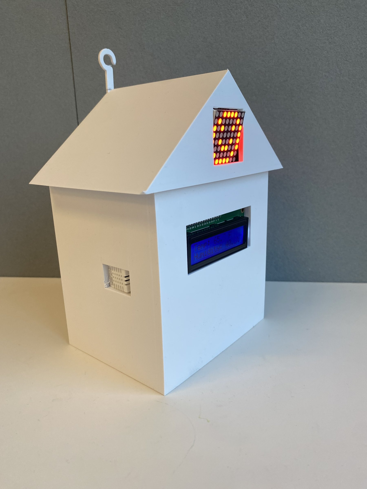
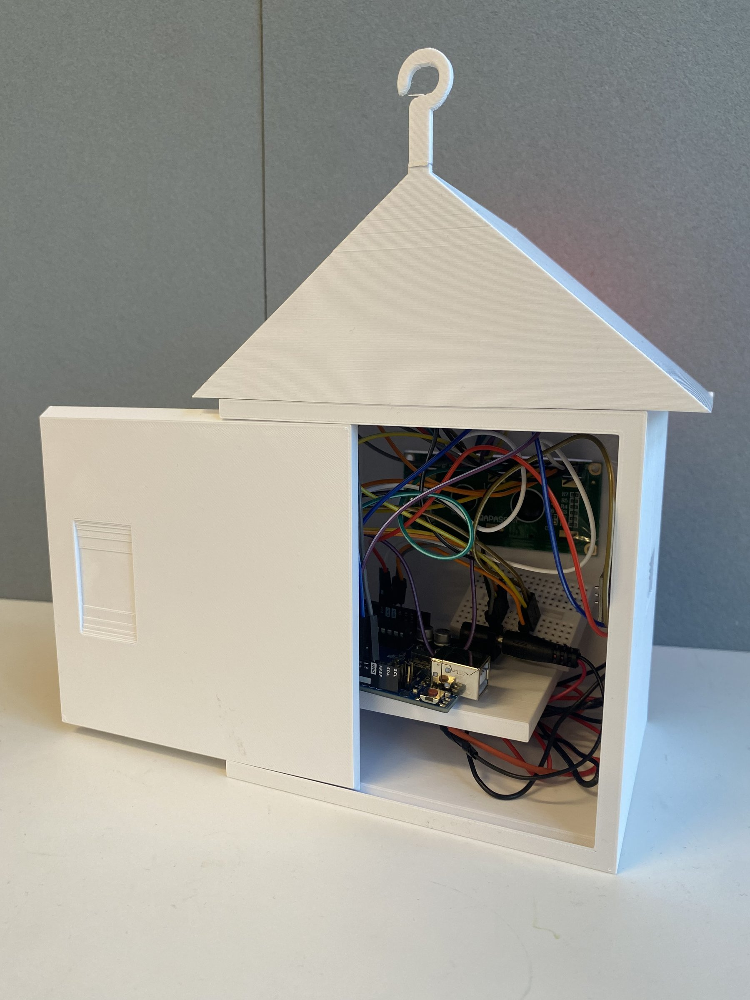

<!-- DRAFT: written by Claude from Ciaran's class presentation (Nov 2025). Ciaran: check every line is true and sounds like you, then delete this note. -->

## Overview

Humidity matters in a bedroom, but most people never think about it. Humidity House makes it something a kid can see. It hangs on the wall like a small house. A screen on the front shows the exact temperature and humidity, and an LED face in the roof smiles when the humidity is in a healthy range and frowns when it isn't.

## Who it's for

I designed it around John, an 11-year-old who is curious about science and spends a lot of time in his room. John is a persona I made up, not a kid I interviewed.

I mapped how John might react to the house over time. The map showed the main risk: if the numbers confused him or the house got boring, he'd walk away and stop looking at it. So the face does most of the work, and the numbers are there for when he gets curious.

## Process

I sketched a few shapes, each with a screen, a face and a hook for hanging. I chose the house because it felt friendly and familiar in a kid's bedroom. It also carries the idea behind the project: a house stands for a home, and the face shows what conditions make a happy, healthy one.

My first container was an open box for testing how the screen and electronics fit. I made the most progress when I made big changes to the container between versions, rather than small tweaks. I then modeled the final house in Fusion 360 and 3D printed it.

## The build

An Arduino reads a temperature and humidity sensor, shows the readings on an LCD screen, and switches the LED face between a smile and a frown. A side panel slides off to reach the wiring inside.

## What I'd change

From in-class feedback and my own reflection:

- **Make it tougher for kids.** Use a bigger hook, or a version that sits on a table, so it's harder to knock down. Make it smaller, with softer, rounded edges.
- **Make the readings clearer.** The small LCD screen limits how much it can show.
- **Tidy the electronics** so the house can be more compact.
- **Give it a more distinctive form.** The house shape is simple.
- **Test it with real kids.** I haven't yet, so I don't know if the face actually keeps an 11-year-old interested. That's the next thing I'd do.
