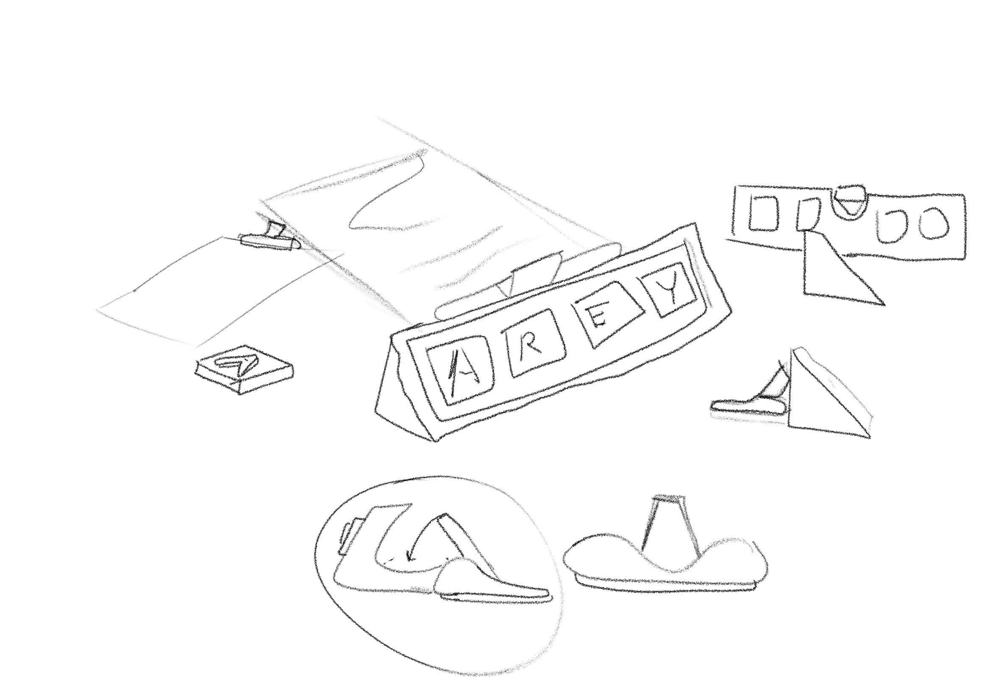
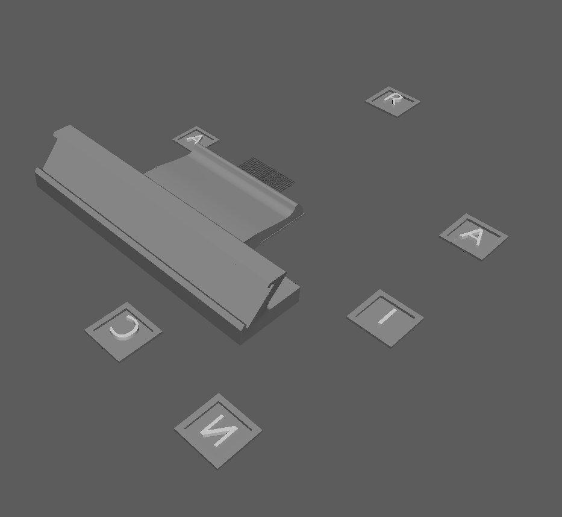
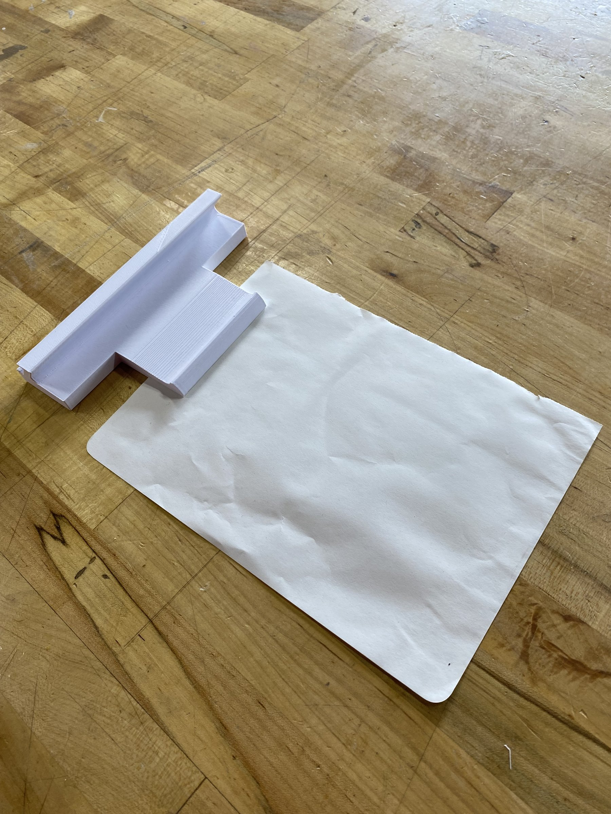
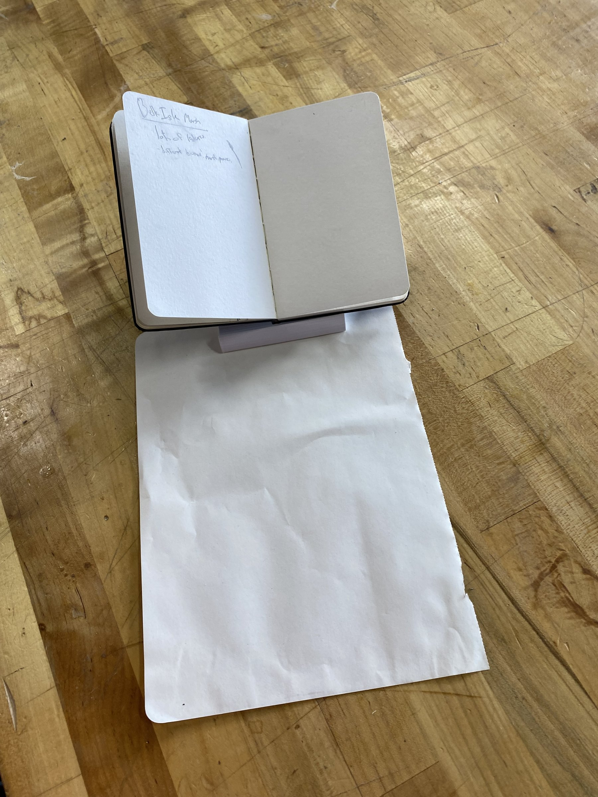

<!-- DRAFT: written by Claude from Ciaran's class presentation (Oct 2025). Ciaran: check every line is true and sounds like you, then delete this note. -->

## Overview

A name tag for classrooms that does two jobs. Kids slide letter tiles in to spell their name, so the same tag can be reused year after year. On the back, a clip holds worksheets and can prop up a small notebook. The idea was to combine something fun for kids with something useful for teachers.

## Process

I started with sketches, then modelled the tag and a set of letter tiles in Maya and 3D printed them. The first version was small. After some early testing, I had more ideas for how the tiles could slide in and out, and the design grew from there.

The main problem was the print not coming out flat.

## Final prototype

## What I'd change

- **Think about the whole classroom.** A teacher might need 20 or more of these, so how they store and take up space matters. I only designed for one.
- **Make bigger changes, faster.** I let a couple of prints go, hoping the problems would fix themselves, instead of spending the time on the details.
- **Choose the material more carefully.** 3D-printed slots came out very smooth, so the clip didn't grip paper well.
- **Size it for real notebooks,** and make it steadier so the clip can hold more, and different kinds of, paper.
- **Lean into the fun.** Maybe there's a game kids could play with the tiles.
