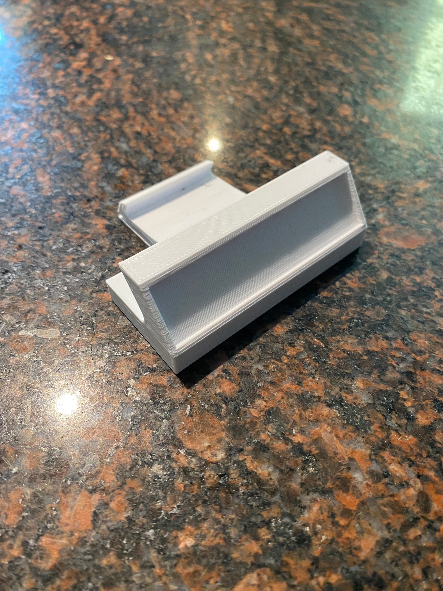
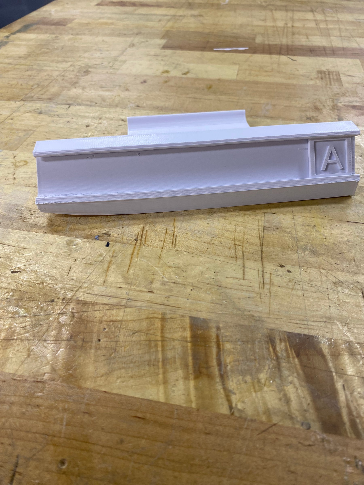
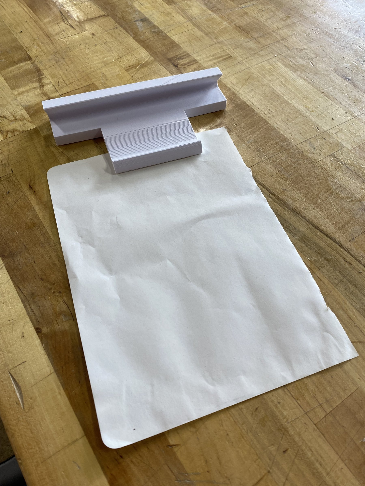
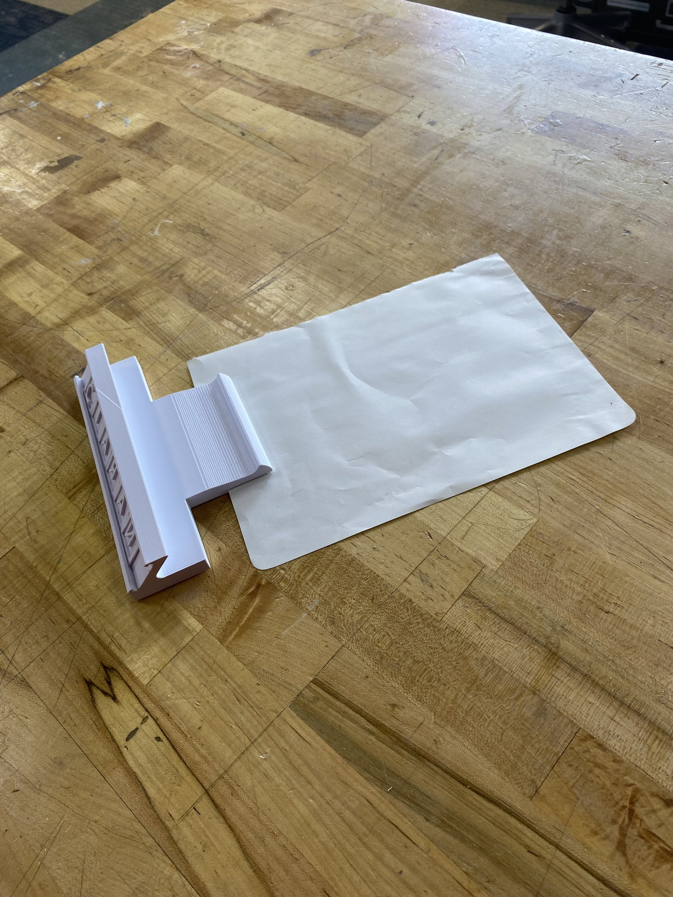
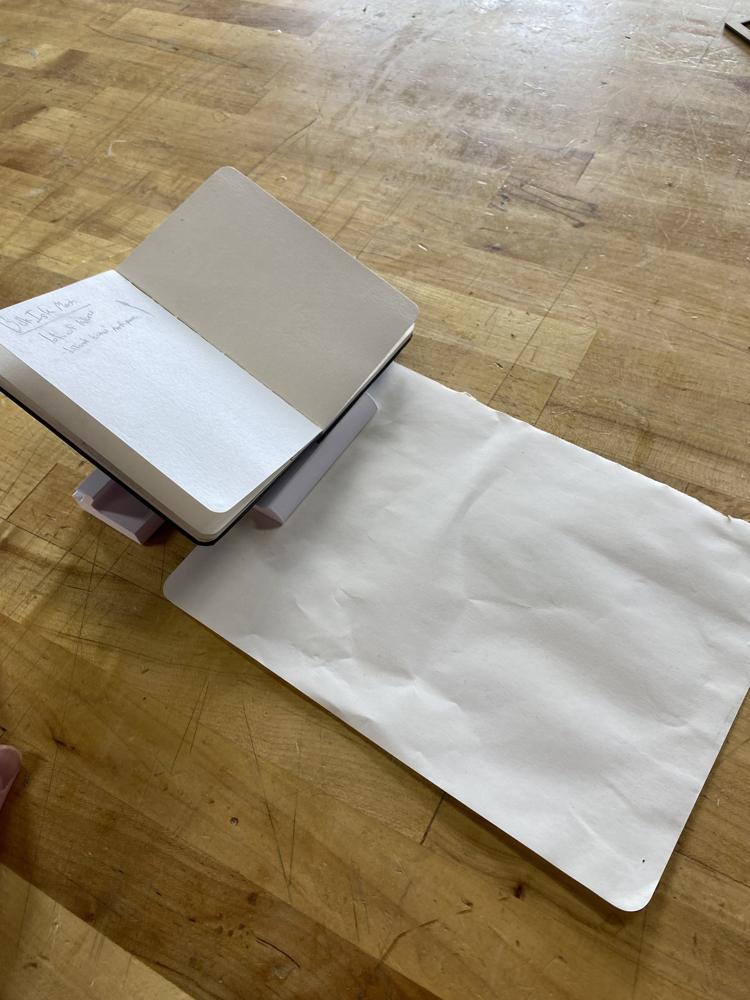

<!-- PLACEHOLDER TEXT: rewrite the paragraphs below in your own words. -->

## Overview

A desk piece that holds your pencil and spells out your name. Each letter is its own printed tile, so the same holder works for anyone.

## Process

I sketched a few directions before modelling the holder and a set of letter tiles.

The first prototype showed what needed to change before the final print.

## Final design

