## The problem

Part of my job at Formlabs was cleaning powder out of the Fuse, their SLS 3D printer, when changing materials to avoid contamination. The powder is extremely fine and gets into every crevice of the machine, and some areas, like the powder troughs and the gaps between the hopper agitator blades, are almost impossible to reach with the standard vacuum nozzle.

A task that should take five minutes was taking half an hour and needed extra tools. Customers ran into the same problem, and some asked on the Formlabs community forum for better ways to clean the hard-to-reach areas.

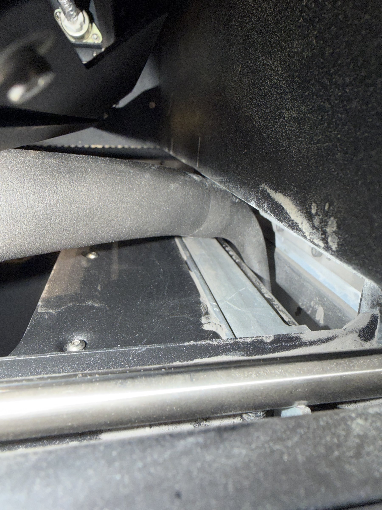
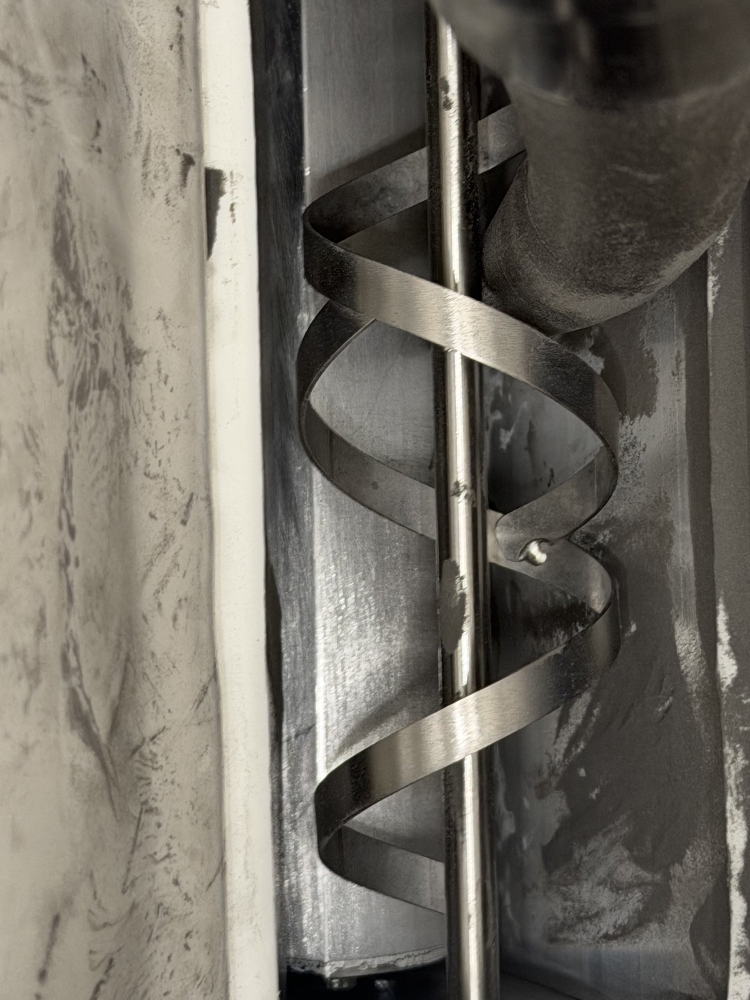

## Early ideas

I started by sketching a single all-in-one nozzle: an S-curve to navigate corners, a bellows section so the tip could bend, holes along the length to pull powder from more than just the tip, and different materials for flexibility.

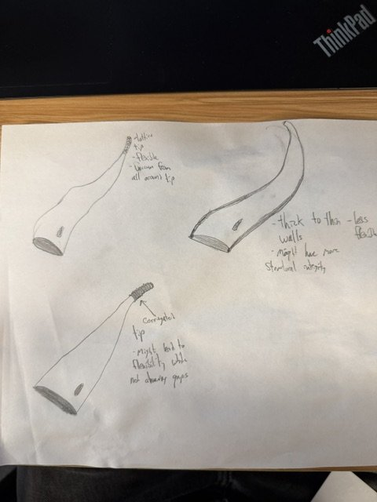
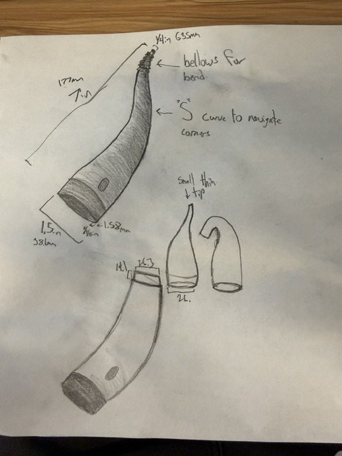

## The key decision: one base, swappable tips

Talking it through with my manager, I realized no single shape could reach every part of the machine well. So I switched from one clever nozzle to a modular system: a base that stays on the vacuum hose, and tips that swap in seconds, each shaped for a specific job.

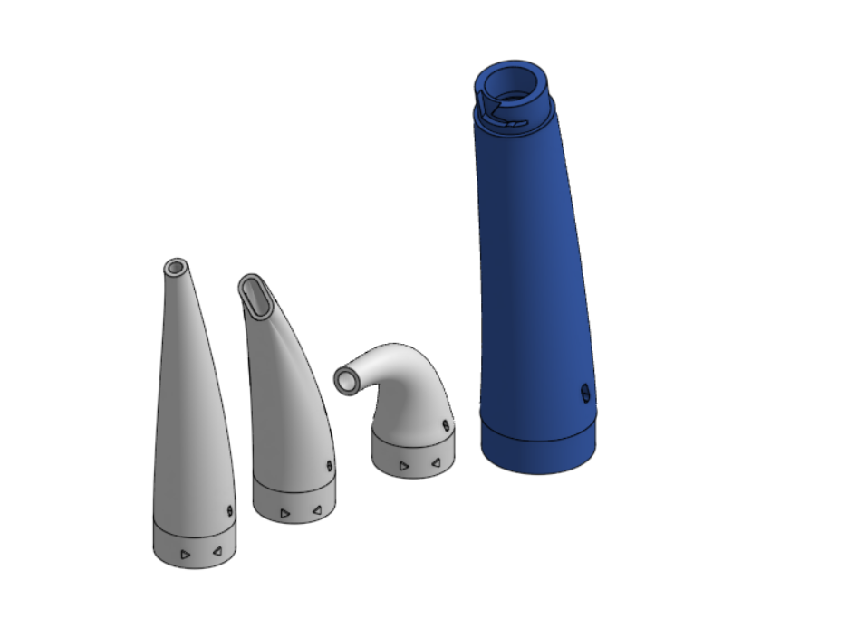

## Designing the connection

The connection had to hold firmly on every customer's printer. I tested several connection styles and chose a bayonet mount over a friction (tolerance) fit. A tolerance fit depends on exact part dimensions, which change with printer settings, so it might be too tight on one machine and too loose on another. A bayonet locks mechanically, so it holds regardless of how the part was printed.

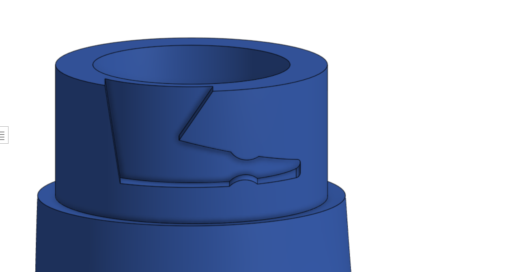
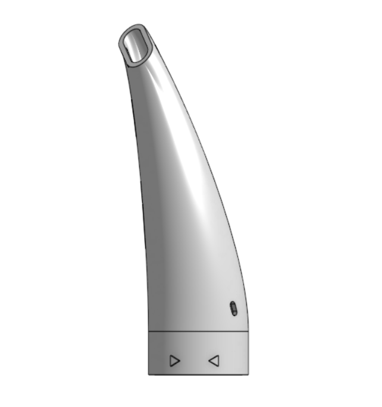
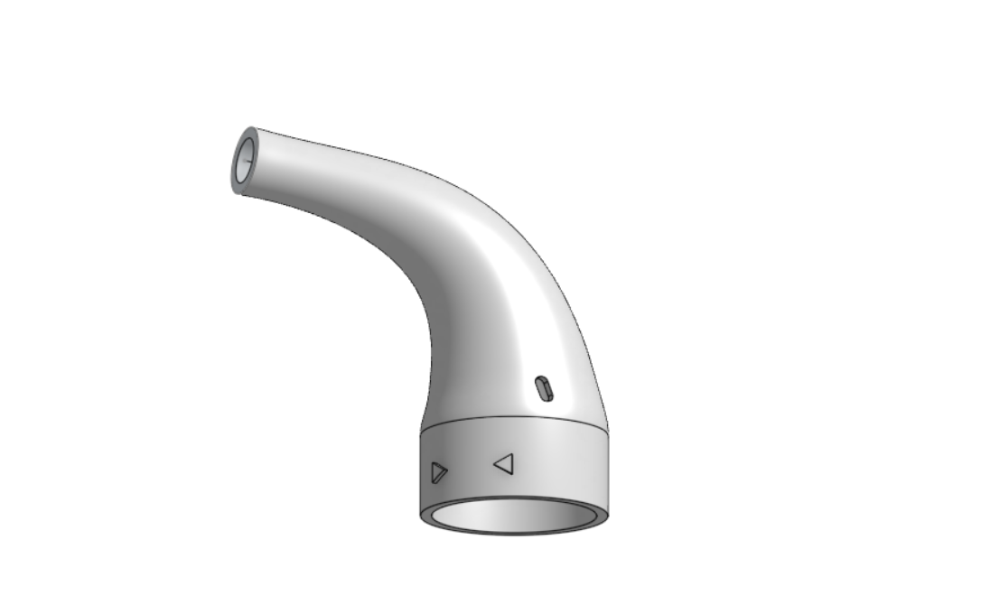

## Iterating the tips

I printed and tested 20+ versions to find which tips actually earned a place in the kit.

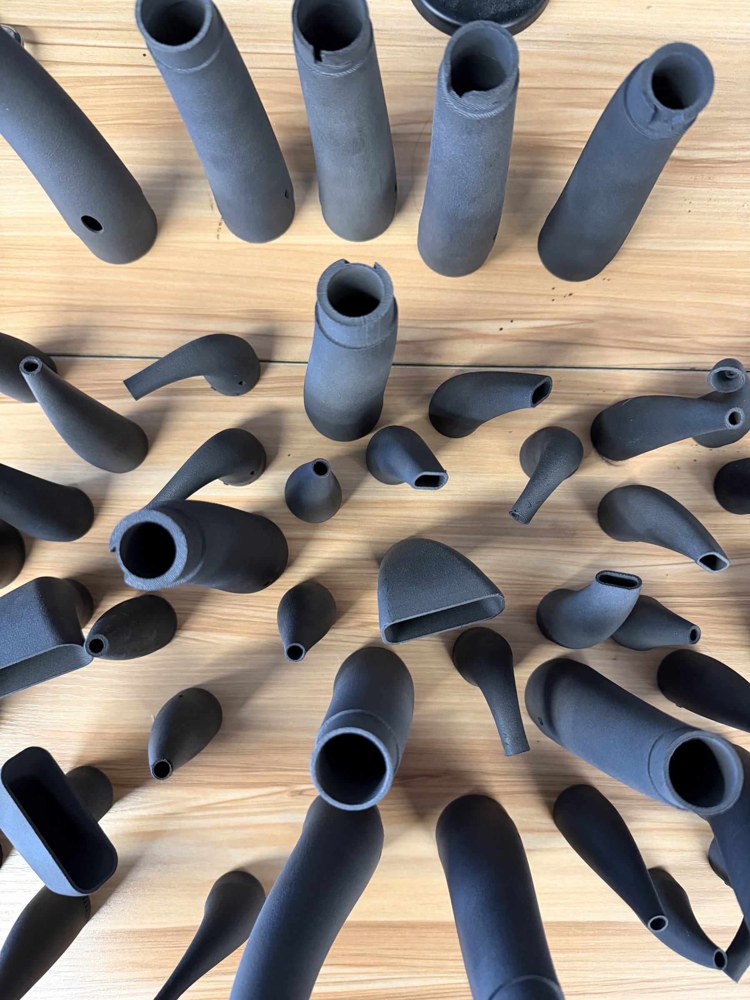

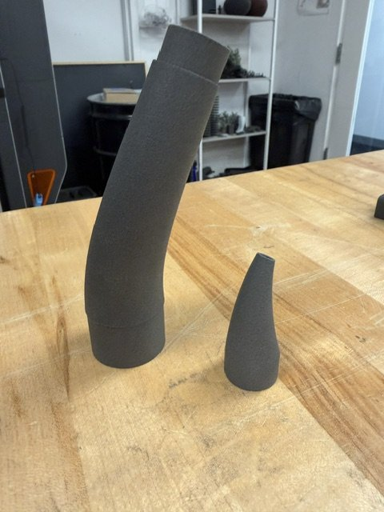
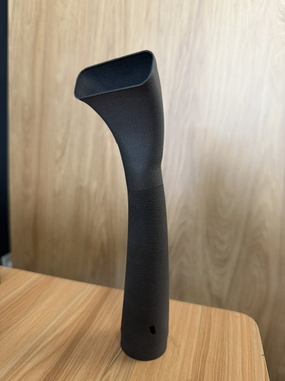
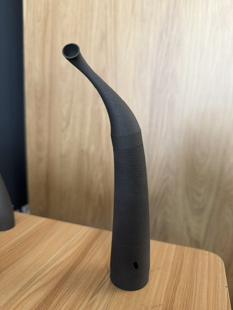

The final kit has three tips:

- **Default tip.** Testing showed it already worked well for general cleaning, so I kept it instead of replacing it for the sake of novelty.
- **Hook tip.** Curves into the powder troughs.
- **Precision tip.** Narrow enough to reach between the hopper agitator blades.

## Testing

I tested the system in real cleaning sessions, collected feedback from my managers and teammates, and tested print material and surface finish to make sure the parts held up in use.

**Result:** The nozzle reached areas the default nozzle couldn't, so cleaning became faster and no longer needed extra tools like compressed air.

## Shipping it

After testing showed it worked, I photographed the system, wrote the instructions, and published it to the Formlabs support site, where it's now part of the official Fuse powder-cleaning procedure.

- [Printable parts for Formlabs devices](https://formlabs.com/support/Printable-parts-for-Formlabs-devices/)
- [Cleaning all powder out of a Fuse 1 generation printer](https://formlabs.com/support/Cleaning-all-powder-out-of-a-Fuse-1/)

## What I learned

The best design choice wasn't a shape. It was reframing the problem, from "one nozzle that does everything" to "a system of simple parts." Designing for manufacturing variability, not just my own printer, is what made it work well enough to ship to customers.
