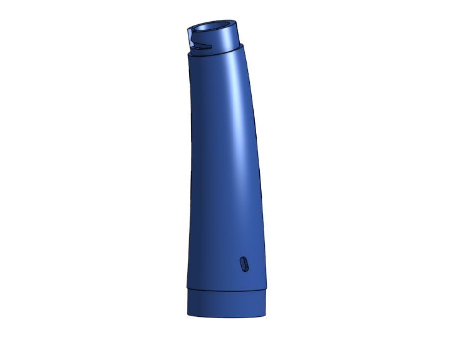
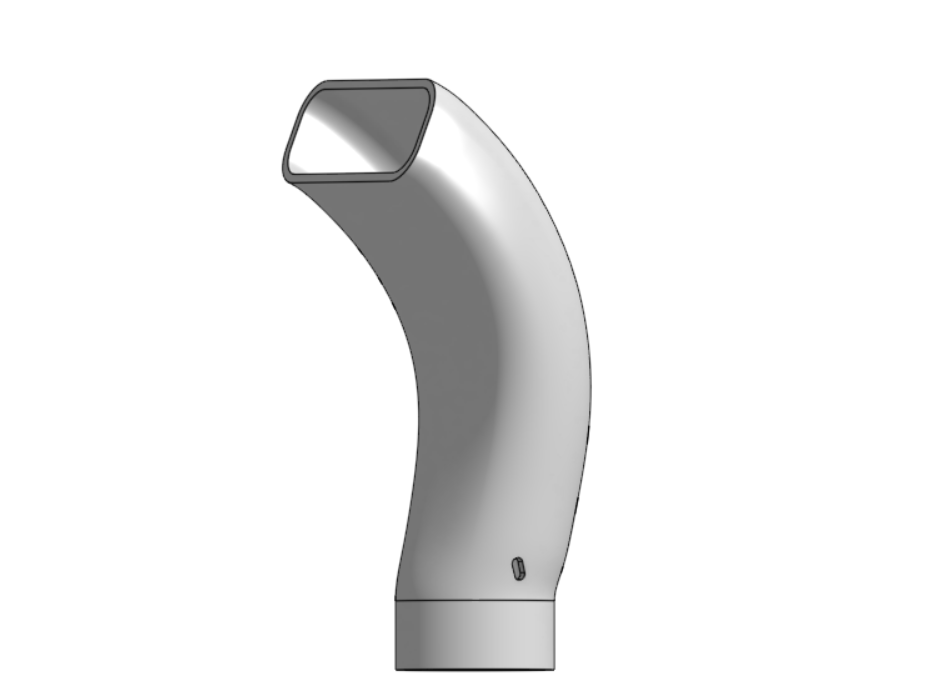
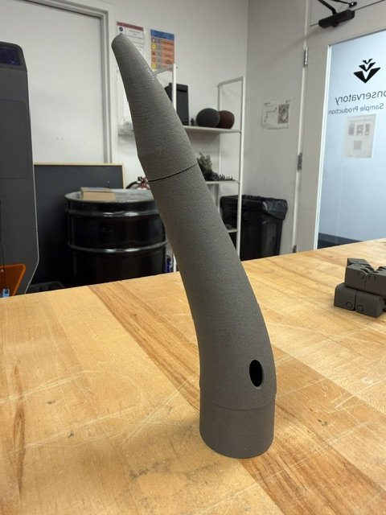
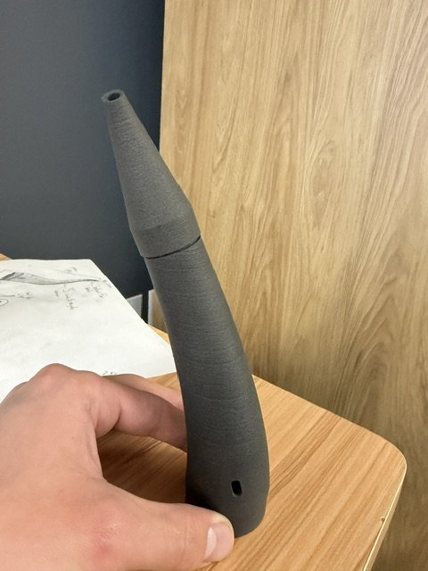
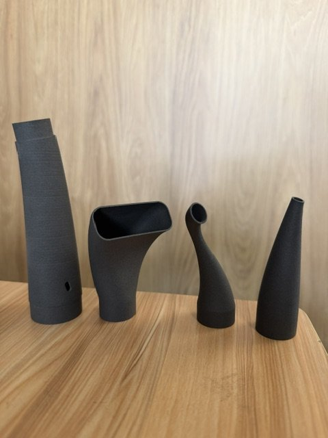
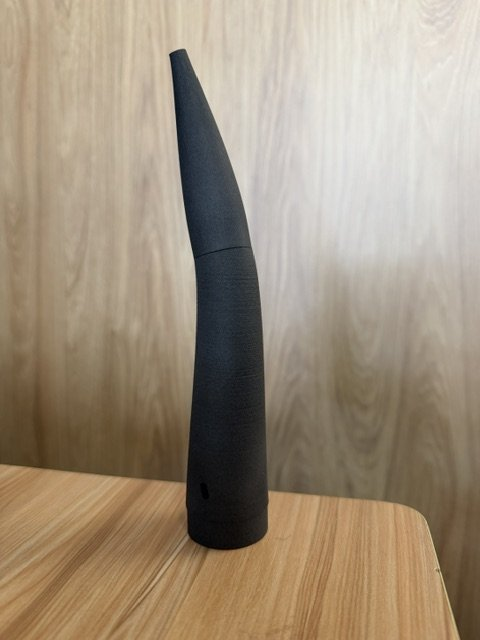
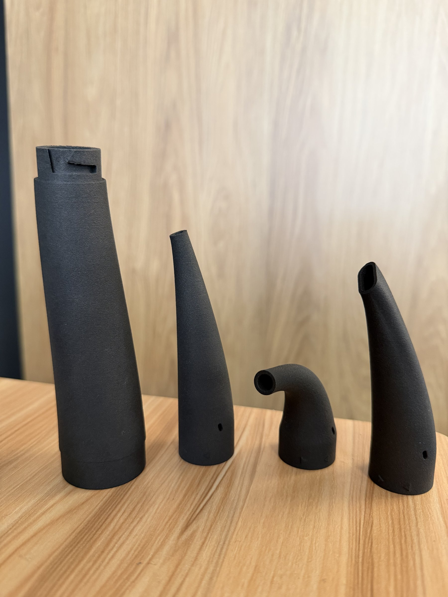
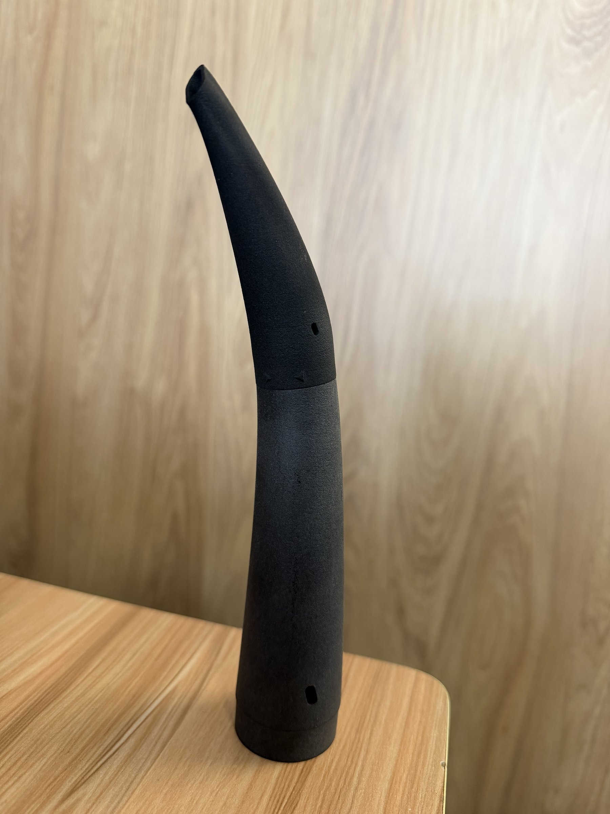
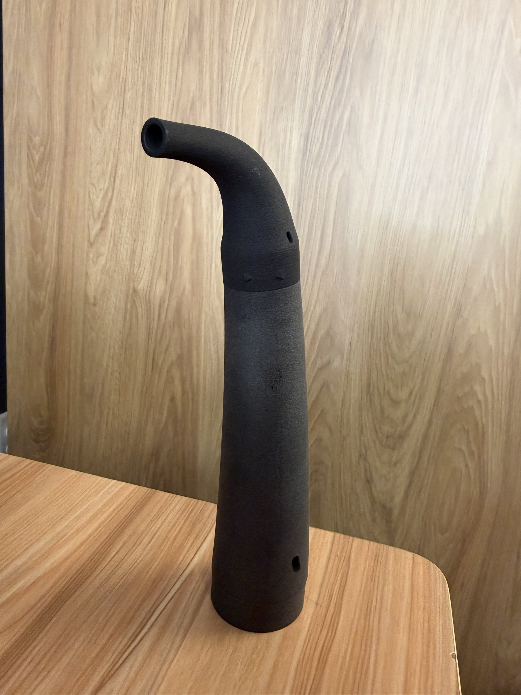

<!-- PLACEHOLDER TEXT: rewrite the paragraphs below in your own words. -->

## Overview

Cleaning leftover powder out of a Fuse printer means reaching into tight corners and around moving parts. During my co-op at Formlabs I designed a modular vacuum nozzle, a base with tips that twist on and off, along with a cleaning workflow to go with it.

## Sketches

I started on paper, working out the curve of the base nozzle and the tip shapes each cleaning job would need.

## CAD

In Onshape I modelled a single base nozzle with a bayonet mount, so each tip locks on with a quarter turn.

## Prototypes

Each version was printed and tested in the printer, checking reach, grip and how well it cleared powder.

## Final design

## In use

## Outcome

I photographed, wrote and published the design and cleaning workflow as an article on the Formlabs support site, so Fuse customers around the world can print and use the nozzle themselves.
